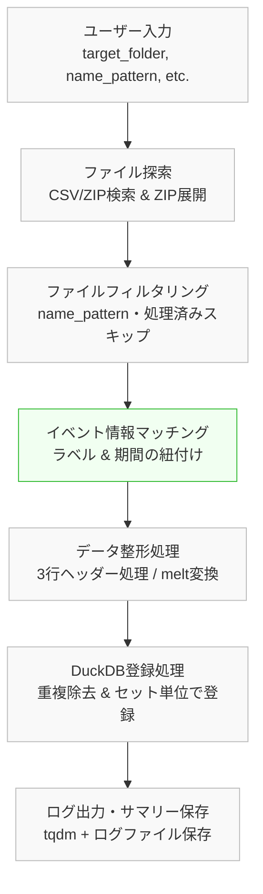

### 📘 スライド1：プロジェクト概要

- **目的**  
  工場のセンサーデータ（CSV/ZIP）をDuckDBに保存し、分析・可視化しやすい形式に変換。

- **対象ユーザー**  
  技術者、分析担当者

---

### 👤 スライド2：ユーザー視点と入力情報

- **ユーザーストーリー**  
  - 技術者：保存先・対象ファイルを明確に  
  - 分析者：すぐに扱える整形データが欲しい  
  - 全体：ログで進捗・エラー確認したい

- **入力項目**  
  `target_folder`, `name_pattern`, `encoding`, `db_path` など  
  イベント情報（event, start_time, end_time など）

---

### 🔁 スライド3：処理フロー概要

1. ファイル探索・グルーピング  
2. name_pattern によるフィルタリング  
3. イベント期間とのマッチング & 処理済みチェック  
4. データ整形（3行ヘッダー → melt）  
5. DuckDB登録（重複排除つき）  
6. ログ出力（tqdm + ファイル）

---

### 📦 スライド4：出力と非機能要件

- **出力結果**  
  - `sensor_data` テーブル  
  - 進捗ログファイル（tqdm）

- **非機能要件（抜粋）**  
  - 処理時間目標：1000ファイル ≦ 10分  
  - 中断→再実行OK  
  - 拡張・保守性あり

---

### 🧯 スライド5：ログ・エラー処理／進行中タスク

- **ログ仕様**  
  - スキップ理由も記録  
  - 致命的エラー以外は continue 処理  
  - 日付付きログファイルも保存

- **進行タスク例**  
  - センサーマスタ分離  
  - イベント情報のDB化  
  - 抽出機能・UI連携など

---

### 🗺️ スライド6：処理フロー図（別資料）

